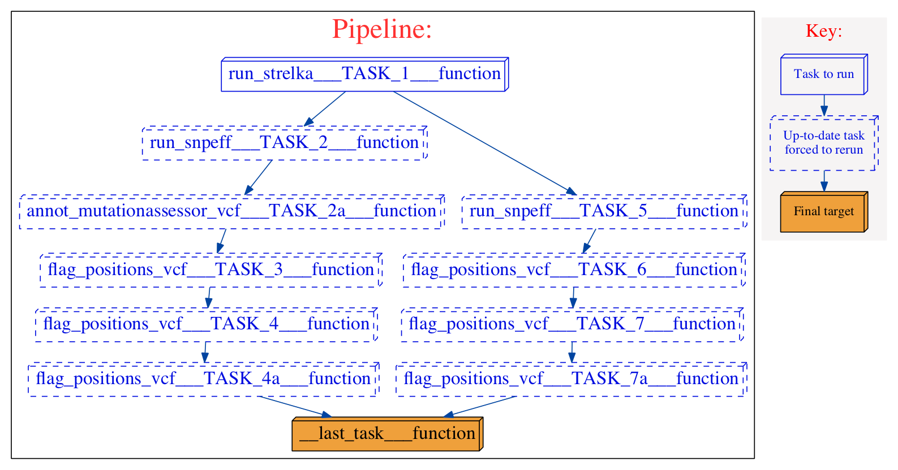

================
Strelka workflow 
================
.. topic:: Development information

    * Date Created : 28 Nov 2014
    * Last Update  : 28 Nov 2014
    * Developer    : Jamie Rosner (jrosner@bccrc.ca)

.. here you can add the workflow plot

..    :figclass: align-center
    
This workflow:

* runs Strelka on the input bam files
* annotates output with snpEff
* flags output with dbsnp and 1000genomes columns

Components
==========
* *Component 1:* 

 * component_name: `run_strelka  <https://github.com/MO-BCCRC/run_strelka>`_
 * component_version: '1.2.0'
 * seed_version: '1.0.13'

* *Component 2:*

 * component_name: `run_snpeff <https://github.com/MO-BCCRC/run_snpeff>`_
 * component_version: '1.0.2'
 * seed_version: 'SnpEff 3.6b (build 2014-05-01)'

* *Component 3:*

 * component_name: `annot_mutationassessor_vcf <https://github.com/MO-BCCRC/annot_mutationassessor_vcf>`_
 * component_version: '1.0.1'
 * seed_version: '1.0.0'

* *Component 4:*

 * component_name: `flag_positions_vcf <https://github.com/MO-BCCRC/flag_positions_vcf>`_
 * component_version: '1.0.3'
 * seed_version: '1.2.0'
        
Requirements
============
* Kronos >=v2.0.4
* Python >= v2.7.6
* Strelka v1.0.13
* Java v1.7.0_06
* Perl v5.8.8+

How to run the workflow
=======================  
**Step 1.** Update the ``setup.txt`` file provided with the workflow by passing proper paths/values to the *value* column.

.. note::

    This file is a tab separated file and the first line, *i.e.* '``#section key value``', is part of the file.
    
**Step 2.** Update the ``input.txt`` file with proper paths/values.

.. note::

    This file is a tab separated file and the first line, *i.e.* '``#sample_id ...``', is part of the file.
    Sample ID's are arbitrary.
    However, they cannot be used more than once in an input file.
      
**Step 3.** Run the workflow using the following command:

.. code:: bash
 
     kronos run -c <path/to/components_dir/ -e <a name for workflow> 
                -i <input.txt> -r <run_id> -s <setup.txt>  
                -w <workind_dir> -y <path/to/config.yaml>

Please note to replace ``<.>`` with the actual values.
See kronos online documentation for more information on the `run <http://kronos.readthedocs.org/en/latest/launch_pipeline/run.html#how-to-run-pipeline>`_ command.

Outputs
=======
The resulting files will be saved in the <working_dir>/<run_id> directory.
For this workflow, the final result files are:

* all.somatic.snvs.vcf
* all.somatic.indels.vcf
* passed.somatic.snvs.vcf
* passed.somatic.indels.vcf
  
Please refer to the Kronos online documentation for more information on the structure of the `results directory <http://kronos.readthedocs.org/en/latest/launch_pipeline/run.html#results-generated-by-a-pipeline>`_.

Changelog
=========
* v4.2 added support for the new shahlab cluster

